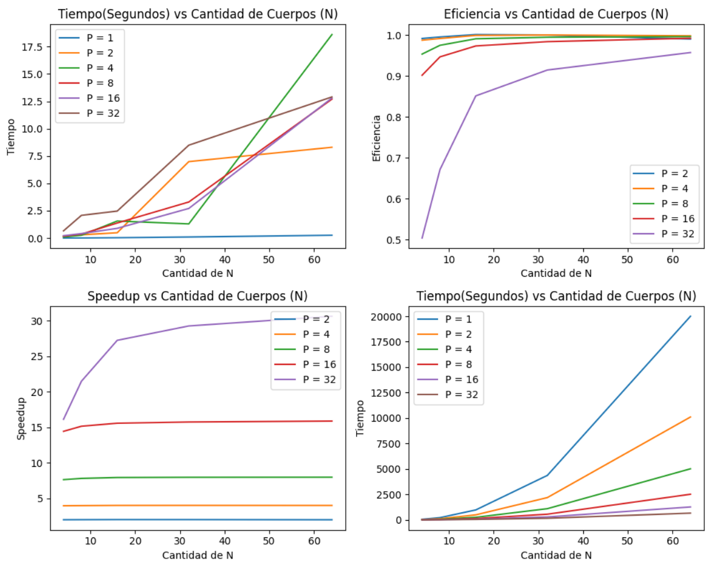

# n-body-project

Este repositorio presenta códigos [1] de N-cuerpos híbridos PhiGPU, desarrollados por el Grupo de Astrofísica de la Universidad de Heidelberg en Alemania [2]. Estos códigos, diseñados para la simulación del movimiento y la interacción de partículas en sistemas físicos, destacan por su capacidad para modelar fenómenos que van desde sistemas astrofísicos hasta dinámicas de fluidos. La implementación aprovecha la potencia de procesamiento paralelo para optimizar los cálculos, distribuyendo eficientemente la carga de trabajo entre múltiples procesadores o núcleos. Con soporte para hasta 36 procesos y la gestión de hasta 65536 agentes, estos códigos abordan todas las combinaciones posibles, ofreciendo un enfoque robusto y eficaz para la simulación de sistemas N-cuerpos a gran escala.

[1]: https://drive.google.com/file/d/1jJ0nu5L4WaET1CIlnlb-ISYUndICFP52/view
[2]: https://drive.google.com/file/d/1Pw9aiDh4Ae84Ga9I7c1q-0zFgoheC-16/view
